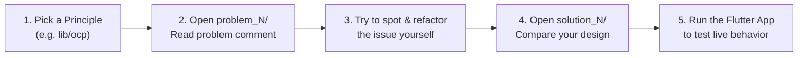

# 🚗 solid_principles_demo

> **Master the SOLID principles through 15 real-world architectural challenges and clean solutions in a production-grade Ride-Hailing & Delivery Driver application.**

[](https://flutter.dev)
[](https://dart.dev)
[](LICENSE)
[](https://linkedin.com/in/ibrahimhaggag)
[](https://github.com/Ibrahim-404)

---

> **15 real architectural mistakes Flutter developers make every day — and how to refactor each one, inside a single, realistic delivery-driver codebase.**

---

## 📌 Suggested GitHub Repository Topics
```text
flutter, dart, solid-principles, clean-architecture, software-design, learning-resource, design-patterns, mobile-architecture
```

---

## 📑 Table of Contents
1. [Why This Repository Exists](#-why-this-repository-exists)
2. [Domain Context: The Ride-Hailing Driver App](#-domain-context-the-ride-hailing-driver-app)
3. [The 5 SOLID Principles Breakdown](#-the-5-solid-principles-breakdown)
   - [S — Single Responsibility Principle (SRP)](#1-single-responsibility-principle-srp)
   - [O — Open/Closed Principle (OCP)](#2-openclosed-principle-ocp)
   - [L — Liskov Substitution Principle (LSP)](#3-liskov-substitution-principle-lsp)
   - [I — Interface Segregation Principle (ISP)](#4-interface-segregation-principle-isp)
   - [D — Dependency Inversion Principle (DIP)](#5-dependency-inversion-principle-dip)
4. [Before & After Comparison Tables (Screenshot Ready)](#-before--after-comparison-tables)
5. [How to Use This Repo (Hands-On Interactive Challenge)](#-how-to-use-this-repo-hands-on-interactive-challenge)
6. [Self-Audit Checklist: Common Mistakes You Might Still Be Making](#-self-audit-checklist-common-mistakes-you-might-still-be-making)
7. [Why SOLID Matters Even More When Working with AI Coding Agents](#-why-solid-matters-even-more-when-working-with-ai-coding-agents)
8. [About the Author](#-about-the-author)

---

## 💡 Why This Repository Exists

Most SOLID tutorials fall into one of two traps:
1. **Academic Toy Examples**: Animals that `makeSound()`, or geometric shapes with `calculateArea()`. They fail to explain how real stateful mobile apps break in production.
2. **Disconnected Snippets**: Showing SRP in an e-commerce cart, OCP in a logger, and DIP in a weather app. You never see how all five principles orchestrate together in one cohesive system.

**`solid_principles_demo` takes a different approach.** Every single example is drawn from **one consistent domain**: a high-scale Ride-Hailing & Courier Driver App (in the spirit of Uber Driver or Careem Captain). From handling active dispatch offers and surge calculations to Bluetooth taximeters and offline tunnel queues, every line of code represents a challenge a real mobile engineer encounters.

---

## 🚕 Domain Context: The Ride-Hailing Driver App

A driver app is one of the most demanding mobile architectures in existence:
- **High-throughput live telemetry**: Continuous GPS streaming while conserving battery.
- **Strict financial accounting**: Surge pricing, platform commissions, tips, and tolls.
- **Multi-modal operations**: Sedans, luxury SUVs, motorbikes, and bicycle couriers.
- **Unreliable networks**: Drivers transitioning into tunnels and underground parking.
- **Regulatory constraints**: Low-emission zones, driver document verification, and regional payment gateways.

---

## 🧱 The 5 SOLID Principles Breakdown

### 1. Single Responsibility Principle (SRP)
> **Social Caption:** *"SRP: A class should have one reason to change — not five."*

Every class, widget, or use case should focus on a single piece of business functionality. When a class juggles persistence, network calls, mathematical billing formulas, and UI haptics, any change requested by one stakeholder risks breaking the features owned by another.

* **Problem 1 vs Solution 1** (`lib/srp/problem_1/` & `solution_1/`): *Trip Acceptance & Dispatch.*
  A monolithic `TripAcceptanceService` handling DB updates, HTTP API calls, driver surge payout math, Firebase analytics, and phone audio/vibrations refactored into focused single-responsibility collaborators orchestrated by `AcceptTripUseCase`.
* **Problem 2 vs Solution 2** (`lib/srp/problem_2/` & `solution_2/`): *Driver Document Verification.*
  A service conflating image compression, OCR identity parsing, AWS S3 uploads, and license expiry rules decomposed into testable, single-purpose components.
* **Problem 3 vs Solution 3** (`lib/srp/problem_3/` & `solution_3/`): *Shift Earnings Report.*
  A single class doing financial commission math, currency localization, CSV document export, and SMS/Email delivery separated into dedicated domain, presentation, and transport classes.

---

### 2. Open/Closed Principle (OCP)
> **Social Caption:** *"OCP: You should be able to extend a feature's behavior without editing a single line of existing, tested code."*

Software entities should be open for extension, but closed for modification. When adding a new feature requires modifying existing `switch` statements or chaining more `if-else` branches, you constantly introduce regression risks and Git merge conflicts.

* **Problem 1 vs Solution 1** (`lib/ocp/problem_1/` & `solution_1/`): *Driver Cashout Payment Gateways.*
  A hardcoded `switch` statement for Bank Transfer and Debit Cards refactored into a polymorphic `PayoutGateway` interface. Adding `InstaPay` or `M-Pesa` requires creating one new class with zero edits to existing gateways.
* **Problem 2 vs Solution 2** (`lib/ocp/problem_2/` & `solution_2/`): *Vehicle Tier Fare Calculation.*
  Branching logic for Economy, Comfort, and Motorcycle fares refactored via the Strategy Pattern. Adding `ElectricScooterFareStrategy` touches zero existing lines of code.
* **Problem 3 vs Solution 3** (`lib/ocp/problem_3/` & `solution_3/`): *Order Dispatch Matching Rules.*
  Chained `if` statements for Cash-on-Delivery, ratings, and vehicle payload refactored into a Specification/Rule Pipeline. Adding a municipal `LowEmissionZoneRule` never modifies the core matching engine.

---

### 3. Liskov Substitution Principle (LSP)
> **Social Caption:** *"LSP: Subtypes must be substitutable for their base types without breaking caller expectations or crashing the app."*

If class `B` extends class `A`, your application should be able to use `B` anywhere `A` is expected without crashes, unexpected exceptions, or defensive type-checking (`is B`). Subclasses must respect the behavioral invariants, preconditions, and postconditions of their parents.

* **Problem 1 vs Solution 1** (`lib/lsp/problem_1/` & `solution_1/`): *Multi-Modal Fleet Capabilities.*
  `BicycleDeliveryCourier` inheriting from a base `Vehicle` that demanded air conditioning and door locks, throwing `UnsupportedError` during passenger dispatch. Refactored into a sound hierarchy (`PassengerVehicle` vs `CargoCourierVehicle`).
* **Problem 2 vs Solution 2** (`lib/lsp/problem_2/` & `solution_2/`): *Trip Cancellation Invariants.*
  Subclass `NonCancellableGovPromoPolicy` throwing unexpected exceptions in a read-only fee query. Refactored with an explicit `CancellationResult` contract that honors base guarantees without surprise crashes.
* **Problem 3 vs Solution 3** (`lib/lsp/problem_3/` & `solution_3/`): *Turn-by-Turn Navigation Routers.*
  `PedestrianCourierRouter` throwing on highway routes and returning empty maneuver lists, crashing the navigation HUD. Refactored with `RouteResult` ensuring contract compliance across all transit modes.

---

### 4. Interface Segregation Principle (ISP)
> **Social Caption:** *"ISP: Don't force clients to implement or depend on methods they never use."*

Fat, bloated interfaces create artificial coupling. When clients are forced to implement dummy methods with empty bodies `{}` or `throw UnimplementedError()`, adding a method to the interface causes a cascade of broken builds across completely unrelated features.

* **Problem 1 vs Solution 1** (`lib/isp/problem_1/` & `solution_1/`): *Driver Trip Event Listeners.*
  A monolithic listener forcing food couriers to implement stubs for passenger boarding, luggage loading, and highway tolls. Segregated into focused interfaces (`TripOfferListener`, `PassengerRideListener`, `FoodDeliveryListener`).
* **Problem 2 vs Solution 2** (`lib/isp/problem_2/` & `solution_2/`): *Device Hardware & Telemetry.*
  A fat interface combining GPS streaming, battery level, crash detection, and Bluetooth taximeters. A simple map widget is decoupled to depend ONLY on `LocationProvider`.
* **Problem 3 vs Solution 3** (`lib/isp/problem_3/` & `solution_3/`): *Driver Wallet & Financial Operations.*
  A read-only top-bar balance widget given full access to `requestInstantCashout()` and `linkBankAccount()`. Segregated into read-only `WalletBalanceReader` queries vs mutating `CashoutCommandService`.

---

### 5. Dependency Inversion Principle (DIP)
> **Social Caption:** *"DIP: High-level business logic should dictate the rules, while low-level plugins and cloud SDKs adapt to them."*

High-level modules should not depend on low-level modules; both should depend on abstractions. When your core business logic directly instantiates native Flutter plugins, Firebase SDKs, or SQLite helpers, your app cannot be unit-tested and becomes held hostage by third-party vendors.

* **Problem 1 vs Solution 1** (`lib/dip/problem_1/` & `solution_1/`): *Live Location Tracking & Cloud Publisher.*
  `DriverLiveTrackingUseCase` directly instantiating `GeolocatorDevicePlugin` and `FirebaseRealtimeDatabase`. Refactored to depend on `LocationStreamSource` and `LiveLocationPublisher` abstractions, allowing instant swap to MQTT and lightning-fast unit tests.
* **Problem 2 vs Solution 2** (`lib/dip/problem_2/` & `solution_2/`): *Offline Trip Queue & Sync.*
  A sync coordinator directly invoking SQLite SQL strings and Dio HTTP clients. Decoupled using repository abstractions (`OfflineTripQueue` and `RemoteTripSyncGateway`).
* **Problem 3 vs Solution 3** (`lib/dip/problem_3/` & `solution_3/`): *Urgent Dispatch Alerts.*
  A coordinator directly hardcoding `FirebaseCloudMessagingPlugin` and native audio alarms, crashing on non-Google devices (Huawei / POS terminals). Decoupled using `PushNotificationGateway` and `UrgentSoundAlertGateway`.

---

## 📊 Before & After Comparison Tables

### Single Responsibility Principle (SRP)
| Scenario | Problem (Before) | What Breaks in Production | Solution (After) | What Is Fixed |
| :--- | :--- | :--- | :--- | :--- |
| **1. Trip Acceptance** | `TripAcceptanceService` handles DB, HTTP API, surge math, Firebase, and audio/haptics in 1 method. | Changing finance rules or analytics vendor requires modifying core trip acceptance, risking dispatch regressions. | Decoupled into `TripRepository`, `TripPayoutCalculator`, `TripAnalyticsTracker`, and `TripAlertService`. | Payout math has 100% unit test coverage in pure Dart. Audio and analytics changes never touch dispatch flow. |
| **2. Document Onboarding** | `DriverDocumentService` handles image compression, OCR, AWS S3 upload, and license expiry validation. | Switching from AWS to Cloudflare R2 or updating legal validity from 30 to 90 days touches the same monolithic file. | Segregated into `DocumentImageCompressor`, `DocumentOcrParser`, `DocumentComplianceValidator`, and `DocumentCloudStorage`. | Compliance rules can be tested in 5ms without mocking camera feeds or cloud credentials. |
| **3. Shift Statement** | `ShiftEarningsReporter` computes accounting, formats localized text, builds CSVs, and sends emails. | Adding tax withholding or Arabic RTL localization risks breaking accounting arithmetic or CSV formatting. | Segregated into `ShiftEarningsCalculator`, `EarningsReportFormatter`, `EarningsCsvExporter`, and `EarningsReceiptSender`. | Presentation and delivery mechanisms are completely decoupled from financial arithmetic. |

### Open/Closed Principle (OCP)
| Scenario | Problem (Before) | What Breaks in Production | Solution (After) | What Is Fixed |
| :--- | :--- | :--- | :--- | :--- |
| **1. Payout Gateways** | `PayoutProcessor` uses a `switch` on `PayoutMethod` with hardcoded fee math and API calls. | Adding InstaPay or M-Pesa requires modifying existing switch cases, risking breaking bank transfer fee math. | Polymorphic `PayoutGateway` interface with self-contained gateway classes. | New payout channels are added by creating one new class. `PayoutService` is closed for modification. |
| **2. Vehicle Fares** | `FareCalculator` branches over `VehicleCategory` with hardcoded base fares, per-km, and minimum rates. | Adding Electric Scooters or Cargo Vans requires editing the calculator and risks fat-fingering car rates. | Strategy Pattern: `VehicleFareStrategy` interface with dedicated strategies per vehicle tier. | Each vehicle tier encapsulates its own rates. Adding new vehicle categories requires zero edits to existing code. |
| **3. Dispatch Rules** | `OrderMatchingEngine` chains `if` checks for Cash-on-Delivery, driver ratings, and cargo weight. | Adding Low-Emission Zone rules or VIP driver requirements bloats the engine with more nested conditions. | Specification Pattern: `OrderMatchingRule` interface executed via an `OrderMatchingPipeline`. | New operational or municipal constraints are added as standalone rules without modifying the engine. |

### Liskov Substitution Principle (LSP)
| Scenario | Problem (Before) | What Breaks in Production | Solution (After) | What Is Fixed |
| :--- | :--- | :--- | :--- | :--- |
| **1. Fleet Hierarchy** | Base `Vehicle` demands AC and door locks; `BicycleCourier` inherits it and throws `UnsupportedError`. | Passenger dispatch loop crashes with unhandled exceptions on bikes, forcing developers to write dirty `is` type checks. | Sound hierarchy: `Vehicle`, `PassengerVehicle` (AC, doors), and `CargoCourierVehicle` (cargo volume). | `PassengerDispatchCoordinator` only accepts `PassengerVehicle`. Subclasses are 100% substitutable without crashes. |
| **2. Cancellation Fees** | Subclass `NonCancellableGovPromoPolicy` throws unexpected `StateError` inside `calculateCancellationFee()`. | The UI cancellation sheet crashes with an unhandled exception, stranding the passenger and driver in an active ride. | `CancellationResult` domain result object encapsulating `isPermitted`, `feeCharged`, and explanation. | All policy subtypes honor the base contract. The UI handles non-cancellable rides gracefully without `try/catch`. |
| **3. Navigation Routers** | `PedestrianCourierRouter` throws on highway routes and returns empty turn directions. | Turn-by-turn HUD widget crashes on `turnDirections.first`, forcing callers to write `if (router is PedestrianRouter)`. | `NavigationRouter` returns `RouteResult` guaranteeing non-empty maneuvers on success and clean domain failures. | Car, Motorcycle, and Walking routers are 100% substitutable. HUD operates without type inspection. |

### Interface Segregation Principle (ISP)
| Scenario | Problem (Before) | What Breaks in Production | Solution (After) | What Is Fixed |
| :--- | :--- | :--- | :--- | :--- |
| **1. Trip Listeners** | Monolithic `DriverTripEventListener` forces food couriers to implement empty stubs for passenger boarding and tolls. | Adding `onChildSeatInspected()` breaks compilation across every food courier listener in the entire app. | Segregated into `TripOfferListener`, `PassengerRideListener`, `FoodDeliveryListener`, and `TollExpenseListener`. | Food delivery widgets implement ONLY `FoodDeliveryListener`. Zero dummy `{}` boilerplate or build failures. |
| **2. Device Telemetry** | Fat interface `DriverDeviceTelemetry` combines GPS, battery, crash detection, and Bluetooth taximeters. | Testing the map widget requires mocking taximeters and crash sensors. Bluetooth changes trigger UI re-testing. | Segregated into `LocationProvider`, `BatteryMonitor`, `CrashDetectionSensor`, and `TaximeterIntegration`. | Map widget depends strictly on `LocationProvider`. Widget tests take 3 lines to mock with zero hardware coupling. |
| **3. Driver Wallet** | `DriverWalletManager` exposes `executeInstantCashout()` and `linkBankAccount()` to a read-only balance header. | Principle of Least Privilege violated: a simple UI header has access to execute real wire transfers. | Segregated into `WalletBalanceReader` (queries) vs `CashoutCommandService` / `BankAccountService` (commands). | Header widget only accepts `WalletBalanceReader`. Impossible for accidental UI clicks to trigger money transfers. |

### Dependency Inversion Principle (DIP)
| Scenario | Problem (Before) | What Breaks in Production | Solution (After) | What Is Fixed |
| :--- | :--- | :--- | :--- | :--- |
| **1. Live Tracking** | `DriverLiveTrackingUseCase` instantiates concrete `GeolocatorDevicePlugin` and `FirebaseRealtimeDatabase` in constructor. | Cannot unit-test tracking logic without physical GPS hardware and live Firebase servers. Migration to MQTT blocked. | Use case depends on `LocationStreamSource` and `LiveLocationPublisher` abstractions. | Unit testing takes 5ms with fake stream sources. Switching to MQTT or Supabase requires 1 new adapter with zero use case edits. |
| **2. Offline Sync** | `OfflineTripSyncCoordinator` directly imports and calls `SqfliteDatabase.instance` and `DioHttpClient`. | Sync policy is bound to raw SQL strings and Dio headers. Upgrading SQLite to Hive or Isar requires rewriting sync logic. | Coordinator depends on `OfflineTripQueue` and `RemoteTripSyncGateway` domain interfaces. | Sync retry rules, batching, and error policies are completely storage-agnostic and unit-testable in pure Dart. |
| **3. Dispatch Alerts** | `DispatchAlertCoordinator` directly instantiates `FirebaseCloudMessagingPlugin` and local notification audio plugins. | Crashes on non-Google devices (Huawei AppGallery, custom delivery POS terminals). Escalation rules are untestable. | Coordinator depends on `PushNotificationGateway` and `UrgentSoundAlertGateway` abstractions. | Multi-store deployment (Google Play vs Huawei AppGallery) works out-of-the-box by injecting the appropriate gateway. |

---

## 🎯 How to Use This Repo (Hands-On Interactive Challenge)

Turn this repository into an active learning exercise instead of passive reading:



1. **Pick a principle folder** (e.g. `lib/ocp/`).
2. **Open `problem_N/` first**: Read the problem doc-block explaining the feature in the delivery-driver domain.
3. **Challenge yourself**: Before looking at the solution, write down:
   - *What specific business change will cause this code to break?*
   - *How would you restructure the classes to follow Clean Architecture?*
4. **Open `solution_N/`**: Compare your refactoring with the solution file. Read the explanation of why the change is proportionate and not over-engineering.
5. **Run the interactive app**: Launch the project on your emulator, device, or web browser (`flutter run`) to interactively trigger the refactored use cases and view simulated console outputs!

---

## ✅ Self-Audit Checklist: Common Mistakes You Might Still Be Making

Scan your current Flutter codebase against this quick 5-point audit:

* [ ] **SRP**: Does your `Repository` or `Bloc`/`Notifier` make HTTP calls, parse JSON, format currency strings, and show `SnackBar`s all in the same file?
* [ ] **OCP**: Do you have a `switch (itemType)` or `switch (userRole)` statement that you have edited more than twice in the past 6 months to add new cases?
* [ ] **LSP**: Do you have a subclass that overrides a parent method with `throw UnimplementedError()` or `throw UnsupportedError()`, or do you find yourself writing `if (model is SpecificSubclass)`?
* [ ] **ISP**: Do your custom listener interfaces or widget contracts have empty methods (`{}`) because certain widgets don't care about half the callbacks?
* [ ] **DIP**: Does your business use case or repository constructor instantiate concrete plugins directly (e.g. `final _prefs = SharedPreferences.getInstance();` or `final _dio = Dio();`) instead of accepting abstractions?

---

## 🤖 Why SOLID Matters Even More When Working with AI Coding Agents

When pairing with AI coding agents (such as Google Antigravity, Claude, Copilot, or Cursor), software design principles change from a "best practice" into a **critical capability multiplier**.

Violating SOLID principles creates monolithic, highly coupled files that exceed context windows and confuse AI reasoning. When an AI agent attempts to modify a class that violates SOLID, it frequently hallucinates side-effects, introduces subtle regressions, or rewrites unrelated methods.

### 🚩 Red Flags in AI Agent Plans & Diffs

| Principle | Red Flag in Agent's Proposed Plan / Diff | Example Instruction to Redirect the Agent |
| :--- | :--- | :--- |
| **SRP** | The agent adds network request logic or currency formatting directly into an existing Bloc/Notifier or UI Widget. | *"Do not add networking or formatting to the controller. Create a dedicated `TripPayoutCalculator` in domain/ and inject it."* |
| **OCP** | The agent opens an existing 100-line `switch` statement or `if-else` chain to append a new case for a newly requested feature. | *"Do not modify the existing switch statement. Refactor this using the Strategy pattern by introducing a new implementation of `PayoutGateway`."* |
| **LSP** | The agent creates a subclass that overrides a parent method with `throw UnsupportedError()` or adds `if (vehicle is Bike)` checks in the caller. | *"Do not throw UnsupportedError in the subclass. Re-evaluate the inheritance hierarchy or model capability interfaces so all subtypes are safely substitutable."* |
| **ISP** | The agent adds a new method to an existing fat interface, then visits 10 unrelated files adding dummy empty methods `{}` to fix compilation. | *"Stop modifying unrelated classes. Segregate the new method into a dedicated, fine-grained interface that only the affected consumer implements."* |
| **DIP** | The agent writes `final _auth = FirebaseAuth.instance;` or `final _dio = Dio();` directly inside a domain UseCase constructor. | *"Do not instantiate concrete SDKs inside the use case. Create an abstract `AuthRepository` interface and inject it through the constructor."* |

### 💬 How to Prompt an AI Agent to Anticipate SOLID Before Writing Code
Use this system prompt directive when working with AI coding agents:
> *"Before writing any code, analyze whether the requested change requires modifying existing classes or if it can be added via extension. Ensure all high-level business logic depends strictly on abstract contracts, keep interfaces segregated to single client roles, and ensure no subclass strengthens preconditions or weakens postconditions."*

---

## 👨‍💻 About the Author

Created with dedication to clean code and Flutter craftsmanship by:

**Ibrahim Mohamed Abo El-Haggag**  
*Flutter Developer*  
- **GitHub**: [github.com/Ibrahim-404](https://github.com/Ibrahim-404)  
- **LinkedIn**: [linkedin.com/in/ibrahimhaggag](https://linkedin.com/in/ibrahimhaggag)

---

## 📄 License

This project is licensed under the MIT License — see the [LICENSE](LICENSE) file for details.  
`Copyright (c) 2026 Ibrahim Mohamed Abo El-Haggag`
